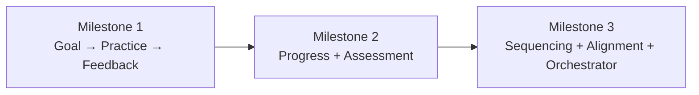

# Curriculum System — Build Strategy

## Critical Path



### Milestone 1: The Learning Loop (build first)

The minimum unit of learning: set a goal, do an exercise, get feedback.

| Order | Agent           | Tool to build               | What you already have                                           |
| ----- | --------------- | --------------------------- | --------------------------------------------------------------- |
| 1     | Goal agent      | `goal_lint` + `goal_commit` | `decide-scope.ts`, `build-evidence-pack.ts`, existing goal flow |
| 2     | Practice agent  | `practice_generate` only    | Nothing yet                                                     |
| 3     | Feedback engine | `feedback_generate` only    | Nothing yet                                                     |

**Wire it:** Companion → goal agent → practice agent → feedback engine. Hard-coded chain. No orchestrator.

**Done when:** A learner can say "I want to learn X," get goals, get an exercise, do it, get feedback, and get a follow-up exercise.

---

### Milestone 2: Memory + Verification

| Order | Agent            | Tool to build                                 |
| ----- | ---------------- | --------------------------------------------- |
| 4     | Progress tracker | `progress_commit` + `progress_read`           |
| 5     | Assessment agent | `assessment_generate` + `assessment_evaluate` |

**Done when:** The system remembers what a learner has worked on across sessions and can verify whether they've actually learned it.

---

### Milestone 3: Intelligence

| Order | Agent             | Tool to build                                          |
| ----- | ----------------- | ------------------------------------------------------ |
| 6     | Sequencing        | `sequence_next` (skip full graph generation initially) |
| 7     | Alignment auditor | `alignment_audit`                                      |
| 8     | Orchestrator      | `curriculum_state` + `curriculum_act`                  |

**Done when:** The system decides what to work on next without the learner having to manage their own path.

---

## Biggest Risks

### 1. Assessment evaluation is unreliable

**The risk:** `assessment_evaluate` asks an LLM to judge whether a learner's work "demonstrates mastery." LLMs are notoriously bad at consistent evaluation — they're lenient, inconsistent across runs, and easily fooled by confident-sounding wrong answers.

**Why it matters:** If mastery signals are unreliable, the entire progress system is built on sand. A learner could be marked "demonstrated" when they haven't actually learned the concept, or "not_demonstrated" when they have.

**Mitigation:**

- Start with **structured rubrics** that break evaluation into yes/no checks, not holistic judgment. "Does the code handle null input? Does it return a structured error? Does it distinguish 4xx from 5xx?" — each checkable independently.
- Use **multi-check suites** (the CWSEI "suites of questions" approach) — don't trust a single evaluation. Require consistency across 2–3 checks.
- For code-based goals: **run the code**. Supplement LLM evaluation with actual test execution where possible. A test that passes is more reliable than an LLM saying "looks correct."
- Log all evaluations with the learner's work and rubric. Review periodically for drift. Build a dataset of evaluation examples to test against.

> [!CAUTION]
> This is the single highest-risk component in the system. Budget significant time for iteration here. Consider keeping human-in-the-loop (learner self-assessment) as a parallel signal.

---

### 2. Exercise generation quality degrades at scale

**The risk:** `practice_generate` needs to create exercises that are genuinely novel, contextually relevant, correctly calibrated in difficulty, and targeting specific expert-thinking components. LLMs tend to produce exercises that look good on first read but are structurally repetitive — same patterns, same surface features, same types of "messiness."

**Why it matters:** CWSEI explicitly warns against exercises that only practice component (i) — routine procedures. If the LLM defaults to generating "implement X given Y" exercises that look varied but are structurally identical, learners get false practice.

**Mitigation:**

- The `previousExercises` parameter is crucial — but the LLM needs to actually USE it, not just acknowledge it. Consider extracting structural features from past exercises (e.g., "components targeted," "surface domain," "constraint type") and feeding those as constraints.
- Validate exercises before presenting them. The `practice_validate` tool exists for this reason — build it for M1, not later.
- Build a **surface feature library** — a list of real-world contexts per topic that the agent can draw from. Don't rely on the LLM's imagination alone.
- Periodically audit generated exercises against the 10-component checklist. Are they actually exercising components a–j, or just claiming to?

---

### 3. The curriculum file becomes a mess

**The risk:** Multiple agents read from and write to the same curriculum file. Without careful schema design, it becomes a dumping ground — inconsistent formats, orphaned references, conflicting states (e.g., progress says "demonstrated" but the last assessment says "not_demonstrated").

**Why it matters:** Every agent depends on the curriculum file. Corrupt data cascades through the entire system.

**Mitigation:**

- Design the **schema first**, before building any agent. Define exactly what each section looks like, what each agent can write to, and what's read-only for whom.
- Each agent should only write to its own section. Goal agent writes goals. Practice agent writes exercises. Progress writes status. No cross-writes.
- The alignment auditor (M3) exists specifically to catch inconsistencies — but you shouldn't need it if the schema is right. Build the schema defensively.
- Consider **versioning** the curriculum file — append changes rather than mutating state. This gives you an audit trail and rollback capability.

---

### 4. Orchestration complexity explodes

**The risk:** The orchestrator needs to decide which agent to invoke, in what order, with what context. The cascade logic (e.g., "goal committed → trigger sequencing → trigger alignment check → update progress") gets complex fast. Prompt-based routing is fragile — one ambiguous user message and the wrong agent fires.

**Why it matters:** A misrouted action is worse than no action. If the user says "I'm stuck" and the orchestrator routes to the goal agent instead of the feedback engine, the experience breaks.

**Mitigation:**

- **Delay the orchestrator as long as possible.** For M1, hard-code the chain. For M2, use simple if/else routing in the companion. Only build the orchestrator when routing logic is too complex for if/else.
- When you do build it, use **explicit triggers** not intent classification. Goal committed → fire sequencing. Assessment completed → fire progress update. These are deterministic events, not LLM-interpreted intents.
- Keep a **fallback to direct agent invocation.** If the orchestrator is confused, let the companion call the agent directly.

---

### 5. Spaced retrieval scheduling is a guess

**The risk:** The sequencing agent uses expanding intervals (1 day, 3 days, 1 week, 2 weeks, 1 month) for spaced review. These intervals come from general cognitive science research (Ebbinghaus, Leitner systems), not from CWSEI specifically. The CWSEI source just says "spaced repeated retrieval" without specifying intervals.

**Why it matters:** If intervals are wrong, reviews either happen too often (annoying, wastes time) or too rarely (learner forgets, false confidence). There's no "correct" interval — it depends on the learner, the material, and the depth of original learning.

**Mitigation:**

- Start with conservative intervals and **adapt based on review outcomes**. If a learner consistently passes reviews at the 1-week mark, extend to 2 weeks. If they fail, shorten.
- Don't over-engineer the scheduler in M1/M2. A simple "flag goals for review after N days" is sufficient. The adaptive algorithm can come later.
- Consider letting the learner control review frequency — "I want to review this more/less often." Agency improves motivation (CWSEI principle).

---

## Dead Ends and Agentic Limitations

### Things that probably won't work agentically

**1. Real-time code execution and testing**

The practice and assessment agents generate exercises that involve writing code. Evaluating code correctness requires running it. LLMs can read code and guess whether it's correct, but they're unreliable — especially for edge cases, runtime behavior, and performance claims.

**What to do instead:** Build a separate code execution layer (sandbox, Docker, WebContainers). The agent generates the exercise and the rubric; a deterministic system runs the tests. The agent interprets the test results. Don't ask the LLM to simulate code execution in its head.

**2. Detecting genuine understanding vs. surface mimicry**

A learner can produce correct-looking answers by pattern-matching LLM-generated exercises. The assessment agent's rubric checks might pass, but the learner hasn't built the mental model CWSEI describes. This is the fundamental limitation of text-based assessment.

**What to do instead:** Use `explain_reasoning` and `transfer_task` formats heavily. Ask learners to explain their thinking, not just produce output. Transfer tasks (same concept, novel domain) are the hardest to fake. Accept that some false positives are inevitable — the suites approach minimizes but doesn't eliminate them.

**3. Knowing what the learner "already knows"**

The `learnerBackground` parameter appears everywhere — but accurately assessing prior knowledge is extremely hard. Learners overestimate what they know. Asking them doesn't produce reliable data. A pre-assessment helps but adds friction.

**What to do instead:** Start every goal with a quick `concept_check` before diving into practice. Let the system discover gaps through use, not through upfront interrogation. The progress tracker will build an accurate picture over time — don't try to front-load it.

**4. Maintaining consistency across multi-agent handoffs**

When the goal agent sets a goal, the practice agent generates exercises for it, the assessment agent evaluates mastery, and the feedback engine comments on work — all four agents are interpreting the same goal statement. But they may interpret it differently. "Implement error handling that distinguishes user errors from system errors" means different things to different prompts at different temperatures.

**What to do instead:** The goal lint rules help (specific verbs, concrete tasks), but consider adding a **goal decomposition** that's machine-readable — not just a prose statement, but structured fields: `verb`, `object`, `context`, `criteria`. All agents read the structured fields, not the prose.

**5. Multi-session coherence**

LLMs have no memory between invocations. The curriculum file provides persistence, but the agent's "understanding" of the learner's journey is reconstructed from flat data every time. Nuance is lost — the learner's frustration, their "aha" moment, the specific way they misunderstood something.

**What to do instead:** The progress tracker's `evidence` and `misconceptions` fields are designed for this. But discipline is required — every session must commit rich notes, not just status codes. The companion (which has conversation history) should summarize each session's key moments and commit them. This is the most important data in the system.

---

## Build Principles

1. **One tool per agent for v1.** Each agent defines 2–4 tools. Build the core _generate/create_ tool first. Add validate, commit, and patterns tools when you feel the pain of not having them.

2. **The system prompts are your spec.** When you implement each agent, paste the system prompt in and build the tool functions it references. The prompt IS the implementation guide.

3. **Test with yourself.** Set a real learning goal, run through the loop, and see where it breaks. One real session worth more than a week of spec writing.

4. **The curriculum file is your database.** Don't overthink storage. A markdown or JSON file per learner. Schema matters more than storage engine. You can migrate later.

5. **Ship M1 before designing M3.** The spec is comprehensive. But the spec is only as good as the feedback loop with real usage. Use M1 for a week before deciding if M2 is the right next step or if M1 needs iteration.

---

## Indispensable Parts — Build These Regardless of Architecture

These are the tools and capabilities that any learning agent needs, whether you use this curriculum system, a completely different design, or even a different LLM framework. They're universal because they address fundamental requirements of learning, not features of our architecture.

### 1. Goal Linting (`goal_lint`)

**Why it's universal:** Every learning system needs to know what the learner is trying to achieve, and vague goals ("understand React") produce vague teaching. The act of forcing a goal through a quality rubric — observable verb, concrete task, testable outcome — is valuable regardless of what happens downstream.

**What makes it indispensable:**

- It's deterministic — rule-based checks, not LLM judgment. Reliable and testable.
- It improves _every other agent's_ output. A well-formed goal makes exercise generation, assessment, and feedback all easier and more targeted.
- It's cheap to build — it's essentially a linter. Blocklist of vague verbs, check for compound goals, verify cognitive level matches verb.
- It works as a standalone tool. Even without the rest of the system, `goal_lint` plugged into a companion makes the companion better at goal-setting.

**Build status:** You have the skeleton in `decide-scope.ts` and `build-evidence-pack.ts`. The lint rules from the agent doc can be implemented as pure functions.

---

### 2. Structured Feedback Generation (`feedback_generate`)

**Why it's universal:** Every learning interaction ends with "how did the learner do?" — and the quality of what happens next determines whether learning occurs. An LLM left to its own devices will say "Great job!" or give rambling corrections. Structured feedback (strengths, gaps, guidance, required action) is better than unstructured feedback in every context.

**What makes it indispensable:**

- The CWSEI research is unambiguous: "The single most important element of assessment supporting learning is the frequency and type of the feedback provided."
- It's format-agnostic — works for code, explanations, designs, written answers, anything.
- The `requiredAction` field is the key differentiator. Feedback without a follow-up action is advice. Feedback WITH a required action is a learning mechanism.
- It can be used inline (during a conversation) or post-hoc (after an exercise). No workflow dependency.

**Build status:** Nothing exists yet. This should be Tool #1 or #2 to build.

---

### 3. Learner State Persistence (`progress_read` / `progress_commit`)

**Why it's universal:** LLMs forget everything between invocations. Without persistent state, every session starts from zero. The learner repeats goals, re-explains their background, and gets exercises they've already done. This is the most basic requirement and the most commonly neglected.

**What makes it indispensable:**

- It enables continuity — "last time we worked on X, you struggled with Y, let's build on that."
- It enables adaptation — difficulty calibration, scaffolding reduction, and spaced review all depend on knowing what happened before.
- It's the foundation for every other "intelligent" behavior. Sequencing, alignment, pattern detection — all read from progress state.
- The schema is more important than the storage. A well-structured JSON/markdown file per learner is sufficient. The key fields: goal status, evidence of mastery, identified misconceptions, session notes.

**Build status:** Nothing exists yet. Should be part of M1 — even a minimal version (just goal status tracking) transforms the experience.

---

### 4. Exercise / Practice Generation (`practice_generate`)

**Why it's universal:** A learning agent that only explains things is a textbook. Doing is where learning happens — CWSEI's "effortful study" principle. The ability to generate contextual, appropriately difficult practice on demand is what separates a learning agent from a chatbot.

**What makes it indispensable:**

- It operationalizes goals. A goal says "you'll be able to do X." An exercise says "do X right now."
- It's the primary driver of the feedback loop — no exercise means no learner work, which means no feedback.
- The 10 expert-thinking components give it structure that generic "generate a practice problem" prompting lacks.
- The `selfCheck` field teaches metacognition — the learner practices evaluating their own work, which is the ultimate learning skill.

**Build status:** Nothing exists yet. Core M1 deliverable.

---

### 5. Curriculum Schema (not a tool — a data contract)

**Why it's universal:** This isn't a tool the LLM calls — it's the shared data format that all tools read from and write to. Without a defined schema, agents generate incompatible data, references break, and state becomes unreliable.

**What makes it indispensable:**

- It's the contract between agents. Goal agent writes goals in format X; practice agent reads goals in format X. If X isn't defined, they'll drift.
- It prevents the "curriculum file becomes a mess" risk (Risk #3 above).
- It can be versioned, validated, and migrated independently of agent logic.
- Even if you scrap every agent and rebuild from scratch, the schema remains useful.

**Key fields that any schema needs:**

```
goals[]:        { id, statement, verb, task, cognitiveLevel, topic, status, createdAt }
exercises[]:    { id, goalId, difficulty, outcome, completedAt }
assessments[]:  { id, goalId, format, outcome, evidence, completedAt }
feedback[]:     { id, goalId, strengths, gaps, requiredAction, actedOn }
progress[]:     { goalId, status, confidence, misconceptions, lastAssessed, reviewDueAt }
```

**Build status:** Not yet defined. Should be the very first thing built — before any agent.

---

### 6. Session Summary / Handoff Notes

**Why it's universal:** This isn't a standalone tool in the current agent definitions, but it's the most critical capability for multi-session learning. At the end of every session, the system needs to capture: what was worked on, what went well, what the learner struggled with, what misconceptions surfaced, and what should happen next.

**What makes it indispensable:**

- It's the bridge between sessions. Without it, progress tracking is just status codes ("in_progress," "demonstrated") with no context.
- It captures the nuance that structured data misses — "the learner understands the concept but keeps making the same error because they confuse X with Y."
- It enables warm starts — the next session can open with "Last time, you were working on X and got stuck on Y. Let's pick up there."
- It's where misconceptions get recorded. Misconceptions are the highest-value data in a learning system — they tell you exactly what to address.

**Build status:** The companion currently doesn't do this. Add a session-end summary step that writes to the curriculum file. This is a prompt change, not a new tool.

---

### Summary: The "Build No Matter What" Stack

```
┌─────────────────────────────────────────┐
│    Curriculum Schema (data contract)    │  ← define first
├─────────────────────────────────────────┤
│  goal_lint        │  progress_read      │  ← build second
│  (quality in)     │  progress_commit    │
│                   │  (memory)           │
├───────────────────┼─────────────────────┤
│  practice_generate│  feedback_generate  │  ← build third
│  (doing)          │  (improving)        │
├───────────────────┴─────────────────────┤
│       Session Summary / Handoff         │  ← wire in last
└─────────────────────────────────────────┘
```

Everything above this line is indispensable. Everything below — orchestration, sequencing, alignment auditing, pattern detection — is optimization. Valuable optimization, but optimization. You can have a functional learning agent with just these 6 pieces.
