# Path A: Storage + Persistence — Deep Dive

## Where We Are Now

Buddy's entire data layer lives in two places:

| What                      | Where                                                                                                    | How                                                                      |
| ------------------------- | -------------------------------------------------------------------------------------------------------- | ------------------------------------------------------------------------ |
| Sessions, messages, parts | [session-store.ts](file:///Users/prashantbhudwal/Code/buddy/packages/buddy/src/session/session-store.ts) | `Map<string, SessionRecord>` scoped per directory via `Instance.state()` |
| Directory isolation       | [instance.ts](file:///Users/prashantbhudwal/Code/buddy/packages/buddy/src/project/instance.ts)           | `AsyncLocalStorage` + per-directory `Map<string, unknown>` cache         |
| Abort controllers         | In `SessionRecord.activeAbort`                                                                           | Ephemeral — doesn't need persistence                                     |

**Everything vanishes on restart.** The `Instance.state()` call on [line 18 of session-store.ts](file:///Users/prashantbhudwal/Code/buddy/packages/buddy/src/session/session-store.ts#L18) creates a fresh empty Map every startup.

---

## Two Design Options

### Option 1: SQLite + Drizzle (OpenCode's approach)

OpenCode uses Bun's native SQLite (`bun:sqlite`) with Drizzle ORM. Its schema lives in [session.sql.ts](file:///Users/prashantbhudwal/Code/opencode/packages/opencode/src/session/session.sql.ts) and DB setup in [db.ts](file:///Users/prashantbhudwal/Code/opencode/packages/opencode/src/storage/db.ts).

```
buddy-data/
└── buddy.db          ← single SQLite file, WAL mode
```

**Tables** (adapted from OpenCode):

| Table     | Columns                                                                              | Notes                                      |
| --------- | ------------------------------------------------------------------------------------ | ------------------------------------------ |
| `project` | `id`, `directory`, `time_created`, `time_updated`                                    | One row per notebook/directory             |
| `session` | `id`, `project_id` (FK), `title`, `time_created`, `time_updated`                     | Maps to current `SessionInfo.Info`         |
| `message` | `id`, `session_id` (FK), `data` (JSON), `time_created`, `time_updated`               | `data` holds the role-specific fields      |
| `part`    | `id`, `message_id` (FK), `session_id`, `data` (JSON), `time_created`, `time_updated` | `data` holds the part-type-specific fields |

> [!TIP]
> OpenCode stores the **mutable/variable fields** as a JSON blob in a `data` column, keeping only IDs and FKs as regular columns. This avoids schema changes when part types evolve — Buddy already has 12 part types.

**Pros**: Battle-tested in OpenCode, great query perf, single file, transactions, WAL for concurrent reads.
**Cons**: Drizzle ORM adds a dependency + migration workflow. More setup upfront.

---

### Option 2: JSON File Storage (OpenCode's legacy layer)

OpenCode also has a [storage.ts](file:///Users/prashantbhudwal/Code/opencode/packages/opencode/src/storage/storage.ts) that writes JSON files keyed by path arrays:

```
buddy-data/storage/
├── session/{projectID}/{sessionID}.json
├── message/{sessionID}/{messageID}.json
└── part/{messageID}/{partID}.json
```

API: `Storage.write(["session", projectID, sessionID], data)`, `Storage.read(...)`, `Storage.list(...)`.

**Pros**: No ORM, no migrations, human-readable files, trivial to debug.
**Cons**: No transactions, file locking needed (OpenCode uses a Lock utility), slower for queries across many sessions, no indexes.

---

### Recommendation

> [!IMPORTANT]
> **Go with SQLite + Drizzle** (Option 1). The spec expects SQLite. OpenCode has already battle-tested the exact pattern with `bun:sqlite`. Drizzle's migration story is clean. And once we add memories/curriculum later, having SQL queries will be much easier than walking JSON files.

We can take a phased approach where the in-memory store still works during the transition (dual-write then cut over).

---

## Phased Breakdown

### Phase 1: Database Foundation

Set up the SQLite infrastructure — db connection, schema, migrations — without changing any existing behavior.

#### New files in `packages/buddy/src/storage/`

| File            | Purpose                                                                    |
| --------------- | -------------------------------------------------------------------------- |
| `db.ts`         | SQLite connection (Bun native), WAL pragma, Drizzle init, migration runner |
| `schema.ts`     | Re-exports all table definitions                                           |
| `schema.sql.ts` | Shared timestamp columns helper                                            |

#### New file in `packages/buddy/src/project/`

| File             | Purpose                                               |
| ---------------- | ----------------------------------------------------- |
| `project.sql.ts` | `ProjectTable` definition (id, directory, timestamps) |

#### New file in `packages/buddy/src/session/`

| File             | Purpose                                                 |
| ---------------- | ------------------------------------------------------- |
| `session.sql.ts` | `SessionTable`, `MessageTable`, `PartTable` definitions |

#### Config

- DB path: `~/.buddy/buddy.db` (or configurable via `BUDDY_DATA_DIR`)
- First migration generated via `drizzle-kit generate`

#### Dependencies to add

```
drizzle-orm
drizzle-kit (devDependency)
```

> [!NOTE]
> No `better-sqlite3` needed — Bun has native SQLite via `bun:sqlite` and Drizzle supports it directly.

---

### Phase 2: Storage Functions

Create a thin data-access layer that mirrors the current `SessionStore` namespace API but reads/writes SQLite.

#### New file: `packages/buddy/src/storage/session-storage.ts`

This module exposes the same operations as today's `SessionStore` but backed by Drizzle queries:

```
SessionStorage.create()          → INSERT into session
SessionStorage.get(id)           → SELECT from session
SessionStorage.list()            → SELECT from session ORDER BY time_updated
SessionStorage.setTitle(id, t)   → UPDATE session SET title
SessionStorage.appendMessage()   → INSERT into message
SessionStorage.appendPart()      → INSERT into part
SessionStorage.updatePart()      → UPDATE part SET data
SessionStorage.listMessages(id)  → SELECT from message + parts JOIN
```

**Data model mapping** (Buddy Zod → SQLite):

```mermaid
graph LR
    subgraph "Buddy Zod Types (unchanged)"
        SI["SessionInfo.Info"]
        MI["MessageInfo (User | Assistant)"]
        MP["MessagePart (12 types)"]
    end

    subgraph "SQLite Tables (new)"
        ST["session table"]
        MT["message table"]
        PT["part table"]
    end

    SI --> ST
    MI -->|"role-specific fields → data JSON"| MT
    MP -->|"type-specific fields → data JSON"| PT
```



The Zod schemas in `message-v2/` stay unchanged. The SQL `data` column stores the `Omit<Info, 'id' | 'sessionID'>` shape, same as OpenCode.

---

### Phase 3: Swap the Store

Replace `session-store.ts`'s in-memory Maps with calls to `SessionStorage`.

#### Modify: [session-store.ts](file:///Users/prashantbhudwal/Code/buddy/packages/buddy/src/session/session-store.ts)

The public API (`SessionStore.create()`, `.get()`, `.list()`, `.appendMessage()`, etc.) stays identical. Internally:

```diff
-const sessions = Instance.state("session.store.sessions", () => new Map<string, SessionRecord>())
+// No more in-memory state. All reads/writes go through SessionStorage.
```

**What stays in-memory**: `activeAbort` (AbortController) — this is runtime-only state that shouldn't be persisted. Keep a small `Map<string, AbortController>` just for that.

**Minimal change surface**: Because `SessionStore` is already a namespace with functions and every consumer goes through it, the swap is invisible to callers (routes, processor, prompt).

---

### Phase 4: Project Persistence + Startup Recovery

#### Modify: [instance.ts](file:///Users/prashantbhudwal/Code/buddy/packages/buddy/src/project/instance.ts)

Currently `Instance.state()` creates ephemeral per-directory caches. After this phase:

- On first request for a directory, check if a `project` row exists. If not, INSERT one.
- `Instance.state()` still works for non-persistent runtime state (bus subscriptions, etc.), but session data no longer uses it.

#### Startup behavior

On server start, the DB already has all sessions/messages/parts. The frontend's initial `GET /session` call returns real historical data. **Sessions survive restart.**

---

## What Changes, What Doesn't

| Layer                        | Changes? | Details                                         |
| ---------------------------- | -------- | ----------------------------------------------- |
| `message-v2/` Zod schemas    | ❌ No    | Schemas stay as-is                              |
| `message-v2/` events         | ❌ No    | Bus events still fire the same payloads         |
| `bus/` event system          | ❌ No    | Untouched                                       |
| `SessionStore` public API    | ❌ No    | Same function signatures                        |
| `SessionStore` internals     | ✅ Yes   | Map → Drizzle queries                           |
| Routes (`routes/session.ts`) | ❌ No    | They call `SessionStore` which has same API     |
| Processor/prompt loop        | ❌ No    | They call `SessionStore` which has same API     |
| Frontend state/UI            | ❌ No    | Same SSE events, same REST responses            |
| `instance.ts`                | 🟡 Minor | Remove session-related `Instance.state()` usage |

> [!TIP]
> Because the `SessionStore` namespace is a clean boundary, the frontend and agent loop are completely unaware of the storage migration. Zero frontend changes.

---

## Effort Estimate

| Phase                 | Effort            | New Files   | Modified Files             |
| --------------------- | ----------------- | ----------- | -------------------------- |
| 1: DB Foundation      | ~1 session        | 4-5 new     | 1 (package.json)           |
| 2: Storage Functions  | ~1 session        | 1-2 new     | 0                          |
| 3: Swap the Store     | ~0.5 session      | 0           | 1 (session-store.ts)       |
| 4: Project + Recovery | ~0.5 session      | 0-1         | 1-2 (instance.ts, startup) |
| **Total**             | **~2-3 sessions** | **5-8 new** | **3-4 modified**           |

---

## What This Unlocks

Once sessions persist:

- **Memories** — can query past sessions to build `memories.local.md` automatically
- **Curriculum** — can store curriculum state alongside sessions
- **Session history** — sidebar shows real historical sessions, not just current-run
- **Progress tracking** — can count sessions, topics, time spent from DB
- **Export** — can generate notes/blog posts from stored conversations

---

## Open Design Questions

1. **Where does the DB file live?** `~/.buddy/buddy.db` (global) vs `{project}/.buddy/buddy.db` (per-project)? OpenCode uses a global data dir. Per-project is more "notebook" aligned.

2. **Drizzle-kit for migrations or manual SQL?** Drizzle-kit generates migration SQL from schema diffs. OpenCode bundles migrations at build time. For dev, `drizzle-kit generate` + `drizzle-kit migrate` is simplest.

3. **Do we dual-write during transition?** Could have both in-memory and SQLite active simultaneously for a brief period to validate. Or just swap — the test surface is small enough.
