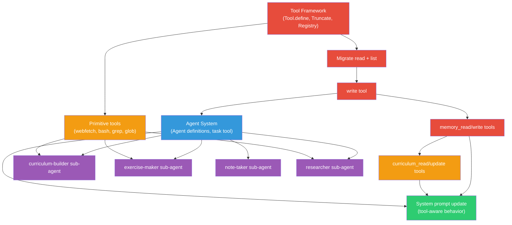

# The Tool Path

> Note (2026-02-21): Storage-specific assumptions in this brainstorm are superseded by the current Buddy SQLite + Drizzle persistence implementation (project-scoped sessions in global XDG storage). Treat this document as tool-path ideation only.

A single document synthesizing everything we've brainstormed about tools for Buddy. This threads together: what we have, how it differs from OpenCode, what a learning agent needs, what goes on the main agent vs sub-agents, and the critical path to get there.

---

## 1. Where We Are

Buddy has **2 read-only tools** (`read`, `list`) in a single file ([tools.ts](file:///Users/prashantbhudwal/Code/buddy/packages/buddy/src/session/tools.ts)). They use the raw Vercel AI SDK `tool()` function. The entire tool system is 204 lines.

OpenCode has **24 tools** across 44 files with a multi-layer architecture:

| Layer             | OpenCode                                                             | Buddy                                            |
| ----------------- | -------------------------------------------------------------------- | ------------------------------------------------ |
| Tool definition   | `Tool.define()` — wraps execute with context, validation, truncation | Raw `tool()` from `ai` package                   |
| Tool context      | `sessionID`, `abort`, `messages`, `metadata()`, `ask()`              | None — execute only sees LLM input               |
| Auto-truncation   | `Truncate.output()` middleware caps output at 2K lines / 50KB        | Manual `truncateByBytes` inside individual tools |
| Tool registry     | `ToolRegistry` — list, init, filter by agent permissions             | `createChatTools()` — returns hardcoded object   |
| Loop architecture | Outer loop (`prompt.ts`) + inner stream (`processor.ts`)             | Single combined loop in `processor.ts`           |
| Safety            | Doom loop detection (3 identical calls), interactive permissions     | Max-step limit only                              |

**The engine is the same** (both use `streamText()` from AI SDK). The difference is the scaffolding _around_ it.

---

## 2. What a Learning Agent Needs

A coding agent's loop is **read → edit → run → repeat**. A learning agent's loop is **read sources → understand → generate materials → track & remember**.

### Direct Tools (on the main agent)

These are quick, atomic, frequent operations that the primary `learner` agent calls directly:

| Tool                | What It Does                                   | Why It's a Direct Tool                             |
| ------------------- | ---------------------------------------------- | -------------------------------------------------- |
| `memory_read`       | Read learner memories (global or per-notebook) | 1-step, frequent (every session start)             |
| `memory_write`      | Persist learner context across sessions        | 1-step, frequent (every session end + mid-session) |
| `curriculum_read`   | Read the current learning path                 | 1-step, just reads a file                          |
| `curriculum_update` | Mark topic complete, reorder items             | 1-step, quick mutation                             |
| `read`              | Read files (already exists)                    | Primitive                                          |
| `list`              | List directories (already exists)              | Primitive                                          |
| `task`              | Delegate to a sub-agent                        | The gateway to all complex work                    |

**Total: 7 tools** on the main agent. Lean enough to not pollute context.

### Sub-Agent Work (delegated via `task`)

These are multi-step, research-heavy, judgment-requiring operations. They get their own session, system prompt, and tool subset:

| Sub-Agent            | Tools It Gets                                 | What It Does                                        | Why It's a Sub-Agent                                                       |
| -------------------- | --------------------------------------------- | --------------------------------------------------- | -------------------------------------------------------------------------- |
| `researcher`         | webfetch, websearch, read, list, grep, glob   | Find resources, explore codebases, answer questions | Research results are large, would pollute main context                     |
| `curriculum-builder` | webfetch, websearch, read, write, memory_read | Design structured learning paths with dependencies  | Multi-step: research → structure → write. Needs focused prompt             |
| `exercise-maker`     | read, write, bash, webfetch, memory_read      | Generate quizzes, flashcards, coding exercises      | Multi-step: read source → create exercises → verify (bash). Complex output |
| `note-taker`         | read, write, memory_read                      | Summarize sessions into structured study notes      | Reads full history, produces large output                                  |

The decision framework:

```
1-2 steps? ──────────→ Direct tool
3+ steps?
  └── Needs own tools? ──→ Sub-agent
  └── No? ───────────────→ Direct tool
```

Additional signals for sub-agent: output is large/complex, needs specialized system prompt, research involved, happens occasionally not frequently.

### Primitive Tools (shared across agents)

These are the building blocks that both the main agent and sub-agents need. They're individually simple but essential:

| Tool        | Port From                                                                                           | Simplifications vs OpenCode                                 |
| ----------- | --------------------------------------------------------------------------------------------------- | ----------------------------------------------------------- |
| `write`     | [write.ts](file:///Users/prashantbhudwal/Code/opencode/packages/opencode/src/tool/write.ts)         | Drop LSP diagnostics. Auto-approve writes in notebook root. |
| `webfetch`  | [webfetch.ts](file:///Users/prashantbhudwal/Code/opencode/packages/opencode/src/tool/webfetch.ts)   | Drop Cloudflare retry. Keep HTML→markdown via Turndown.     |
| `websearch` | [websearch.ts](file:///Users/prashantbhudwal/Code/opencode/packages/opencode/src/tool/websearch.ts) | Direct port. Uses Exa API.                                  |
| `bash`      | [bash.ts](file:///Users/prashantbhudwal/Code/opencode/packages/opencode/src/tool/bash.ts)           | Drop tree-sitter validation. Simple spawn + timeout.        |
| `grep`      | [grep.ts](file:///Users/prashantbhudwal/Code/opencode/packages/opencode/src/tool/grep.ts)           | Direct port. Search file contents.                          |
| `glob`      | [glob.ts](file:///Users/prashantbhudwal/Code/opencode/packages/opencode/src/tool/glob.ts)           | Direct port. Find files by pattern.                         |

These are available to sub-agents via the permission system — the main agent doesn't need all of them directly.

---

## 3. The Infrastructure Gap

Before we can add tools or sub-agents, Buddy needs the tool _framework_ that OpenCode has. Here's what's missing:

### 3.1 `Tool.define()` — Rich Tool Context

Currently, a Buddy tool's `execute` only receives the LLM's raw input. It can't access the session, can't abort cleanly, can't stream metadata to the UI.

**What to build:** A `Tool.define()` wrapper that passes a `Context` object alongside the LLM's parameters:

```typescript
// What Buddy needs
type Context = {
  sessionID: string
  messageID: string
  abort: AbortSignal
  messages: MessageWithParts[]
  metadata(input: { title?: string; metadata?: Record<string, any> }): void
}
```

**What to skip for now:** `ask()` (interactive permissions). Buddy doesn't have a permission system yet. Add it when we need to gate destructive operations.

### 3.2 `Truncate` — Auto-Truncation Middleware

A tool that accidentally returns 500KB of text will blow the context window. OpenCode's `Tool.define()` automatically caps output at 2,000 lines / 50KB and saves the full output to a temp file.

**What to build:** Port `Truncate.output()`. Drop the scheduled cleanup job initially.

### 3.3 `ToolRegistry` — Tool Listing and Initialization

Currently `createChatTools()` returns a hardcoded object of 2 tools. As tools grow, we need a registry that:

1. Lists all available `Tool.Info` objects
2. Initializes them (some tools need async setup)
3. Filters by agent permissions (for sub-agents)

### 3.4 Agent System — Sub-Agent Definitions

For sub-agents to work, Buddy needs:

1. Named agent definitions with system prompts and tool subsets
2. A `task` tool that creates a child session and runs a prompt through a different agent
3. A way to control which tools each agent has access to

This is the most complex piece. In OpenCode, agents are defined in [agent.ts](file:///Users/prashantbhudwal/Code/opencode/packages/opencode/src/agent/agent.ts) with permissions that control tool access. Each agent has: `name`, `mode` (primary/subagent), `permission` (tool ruleset), `prompt`, `model`, and `steps` (max loop iterations).

### 3.5 Wiring Changes

[llm.ts](file:///Users/prashantbhudwal/Code/buddy/packages/buddy/src/session/llm.ts) currently calls `createChatTools()` directly. It needs to:

1. Call `ToolRegistry.tools()` to get initialized tools
2. Build a `Tool.Context` for this request
3. Wrap each tool into an AI SDK `tool()` — this is where the context injection happens

[processor.ts](file:///Users/prashantbhudwal/Code/buddy/packages/buddy/src/session/processor.ts) needs to pass `sessionID` and `messageID` down to `llm.ts` so tools can access them.

---

## 4. The System Prompt Changes

Tools shape behavior. Today's prompt is generic:

```
You are Buddy, a learning companion with strong coding ability.
```

With tools + sub-agents, it becomes:

```
You have the following tools:
- memory_read/write: Read memories at session start. Write when you learn
  something important about the learner (struggles, preferences, progress).
- curriculum_read/update: Check the learning path. Mark topics complete
  when the learner demonstrates understanding.
- task: Delegate complex work to specialized agents:
  - "researcher": find resources, explore codebases
  - "curriculum-builder": design learning paths (use when creating a new curriculum)
  - "exercise-maker": generate quizzes and exercises (use when learner needs practice)
  - "note-taker": summarize sessions into study notes

Behavior:
- ALWAYS read memories at the start of a new session
- ALWAYS write memories at natural conversation endpoints
- When asked to create a curriculum, delegate to curriculum-builder, don't do it yourself
- When the learner seems ready to practice, delegate to exercise-maker
```

**Tools don't just add capabilities — they define Buddy's behavioral loop.** The `memory_write` tool is what makes Buddy actually remember. The `task` tool to `exercise-maker` is what makes Buddy actively quiz learners.

---

## 5. Critical Path

What depends on what, and in what order:



| Color     | What                                                  | Why This Order                                                                  |
| --------- | ----------------------------------------------------- | ------------------------------------------------------------------------------- |
| 🔴 Red    | Framework → migrate → write → memory                  | Foundation. Can't do anything without write. Memory is the core differentiator. |
| 🟠 Orange | curriculum tools, primitive tools                     | Curriculum gives structure. Primitives are needed by sub-agents.                |
| 🔵 Blue   | Agent system + task tool                              | Unlocks sub-agents. Depends on primitives existing for agents to use.           |
| 🟣 Purple | Sub-agents (curriculum-builder, exercise-maker, etc.) | The payoff. Each sub-agent requires its primitive tools + agent system.         |
| 🟢 Green  | System prompt update                                  | Last, because it documents the tools that exist.                                |

---

## 6. Open Questions

### Infrastructure

1. **Do we need `Tool.define()` right away, or can we start adding tools with raw `tool()` and refactor later?** Starting simple is faster, but refactoring 10 tools later is painful.

2. **Is auto-truncation blocking?** If tool outputs are small (memory reads, file writes), truncation can wait. If we add `bash` or `webfetch` early, it becomes important.

### Sub-Agents

3. **Cost of sub-agents with Kimi.** Each sub-agent invocation is a full LLM call with its own system prompt. Kimi's token pricing determines whether this is cheap or expensive.

4. **Sub-agent reliability.** The main agent must correctly decide _when_ to delegate. This is entirely prompt-driven. How reliably does Kimi follow "delegate to curriculum-builder, don't do it yourself"?

5. **Start with tools, add sub-agents later?** Maybe initially put everything on the main agent and only introduce sub-agents when context pollution becomes a measurable problem. Avoids premature abstraction.

### Learning-Specific

6. **Memory format.** Free-form markdown (flexible, LLM-friendly) vs structured JSON (queryable). Markdown is more natural; JSON is more searchable at scale.

7. **Right sidebar rendering.** Exercises need interactive UI (flip cards, radio buttons, code editors). Is that a tool concern (return structured JSON) or a frontend concern (detect exercise patterns in markdown)?

8. **System prompt as the behavior engine.** Many "learning behaviors" (read memories at session start, summarize at session end) can be prompt instructions instead of tools. Which pattern is more reliable?

### Sequencing

9. **What's the MVP?** The fastest path to "Buddy remembers things across sessions" is: `write` tool + `memory_read`/`memory_write` tools + system prompt update. No framework refactor needed. Is that the right starting point?
