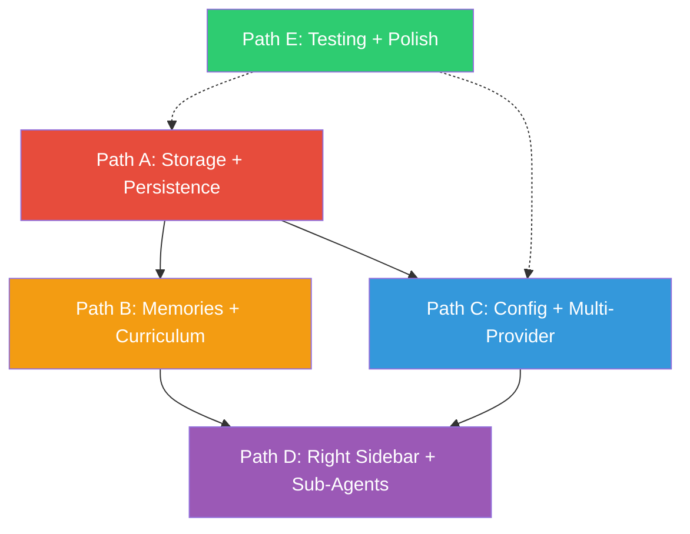

# Buddy — Where Are We? Where Do We Go?

## What's Been Built (4 sessions)

| Session                       | What Shipped                                                                                                                        |
| ----------------------------- | ----------------------------------------------------------------------------------------------------------------------------------- |
| **Monorepo Init**             | Turbo + Bun monorepo, Hono backend, Vite+React frontend, shadcn/ui, SDK generation                                                  |
| **Agent Loop Vertical Slice** | Kimi provider, manual multi-step processor loop, `read`/`list` tools, SSE streaming, chat UI with markdown rendering                |
| **Multi-Tenant Zustand**      | Directory-scoped backend stores, Zustand frontend state, SSE sync manager, `x-buddy-directory` header                               |
| **UI Parity + Hardening**     | Directory-root allowlist, scoped SSE delivery, OpenCode-style sidebar/prompt dock, directory picker bridge, import resolution fixes |

### Current Architecture

```
Backend (Hono)                    Frontend (React/Vite)
├── bus/ (event system)           ├── state/ (Zustand chat store)
├── project/ (directory/instance) ├── components/ (sidebar, prompt, markdown)
├── routes/ (global SSE, session) ├── routes/ (chat, directory-scoped)
├── session/                      └── lib/ (parsers, pickers, tokens)
│   ├── processor.ts (loop)
│   ├── prompt.ts (orchestrator)
│   ├── message-v2/ (parts/events)
│   ├── tools.ts (read/list)
│   ├── llm.ts (Kimi wiring)
│   └── session-store.ts (in-memory)
└── index.ts (app entry)
```

---

## Gap Analysis: Spec vs Built

From [spec/index.md](file:///Users/prashantbhudwal/Code/buddy/spec/index.md) and [README.md](file:///Users/prashantbhudwal/Code/buddy/README.md):

| Spec Feature                          | Status         | Notes                                                                               |
| ------------------------------------- | -------------- | ----------------------------------------------------------------------------------- |
| Chat interface                        | ✅ Built       | Streaming, markdown, tool/reasoning display                                         |
| Tool use display                      | ✅ Built       | Collapsible tool calls in chat                                                      |
| Thinking display                      | ✅ Built       | Reasoning blocks rendered                                                           |
| Multi-project (notebooks)             | 🟡 Partial     | Directory-scoped sessions exist, but no "notebook" concept with memories/curriculum |
| **Persistent storage**                | ❌ Not started | Everything in-memory; spec expects SQLite                                           |
| **Cross-session memory**              | ❌ Not started | No `memories.local.md`, `memories.global.md`                                        |
| **Curriculum system**                 | ❌ Not started | No `curriculum.md` CRUD                                                             |
| **Progress tracking**                 | ❌ Not started | No knowledge graph or progress view                                                 |
| **MCP server support**                | ❌ Not started | Spec says buddy connects to MCP servers                                             |
| **Configurable via config files**     | ❌ Not started | No `buddy.md` or config system                                                      |
| **Right sidebar (2nd level content)** | ❌ Not started | Spec wants detail panel for thoughts/docs/quizzes                                   |
| **Spinning up opencode/sub-agents**   | ❌ Not started | Spec says buddy can invoke opencode for coding tasks                                |
| **App generation (teaching apps)**    | ❌ Not started | Buddy should create React apps for teaching                                         |
| Spaced repetition                     | ❌ Not started | Roadmap item                                                                        |
| Voice interface                       | ❌ Not started | Roadmap item                                                                        |
| Export notes as blog posts            | ❌ Not started | Roadmap item                                                                        |

---

## Gap Analysis: OpenCode Features Buddy Could Port

OpenCode has ~43 subsystem directories. Buddy has adapted patterns from ~5 of them. High-value ports:

| OpenCode Subsystem                        | What It Does                                                                              | Buddy Priority                                                          |
| ----------------------------------------- | ----------------------------------------------------------------------------------------- | ----------------------------------------------------------------------- |
| **storage/**                              | JSON-file persistence with `write`/`read`/`update`/`list` ops (Drizzle/SQLite underneath) | 🔴 **Critical** — everything is in-memory                               |
| **tool/** (write, edit, bash, glob, grep) | Full coding tool suite                                                                    | 🟡 Medium — learning agent needs fewer tools, but file write would help |
| **mcp/**                                  | MCP server client integration                                                             | 🟡 Medium — spec explicitly mentions this                               |
| **session/prompt/**                       | Sub-prompt directory with compaction, instruction loading                                 | 🟡 Medium — needed for context management                               |
| **config/**                               | Config file loading system                                                                | 🟡 Medium — spec wants `buddy.md` support                               |
| **provider/**                             | Multi-provider support (not just Kimi)                                                    | 🟡 Medium — currently hardcoded to Kimi                                 |
| **snapshot/**                             | Conversation snapshot/restore                                                             | 🟢 Low for now                                                          |
| **permission/**                           | User permission system for tools                                                          | 🟢 Low                                                                  |
| **lsp/**                                  | Language server protocol                                                                  | 🟢 Low                                                                  |
| **pty/**                                  | Terminal emulation                                                                        | 🟢 Low                                                                  |
| **share/**                                | Share conversations                                                                       | 🟢 Low                                                                  |

---

## Possible Paths Forward

### Path A: **"Make It Real" — Storage + Persistence**

> Get off in-memory. Make sessions survive restarts.

- Port OpenCode's storage layer (or build a simpler SQLite adapter)
- Persist sessions, messages, parts to SQLite
- This is prerequisite for _everything_ in the spec: memories, curriculum tracking, progress

**Effort**: Medium (~2-3 sessions)
**Unlock**: Foundation for all learning features

---

### Path B: **"Make It Smart" — Memories + Curriculum**

> Build the learning-specific features that differentiate Buddy from a generic chat.

- Implement `memories.local.md` and `memories.global.md` auto-creation and loading
- Implement `curriculum.md` CRUD (agent can create/update/display curriculum)
- Wire memories into system prompt context
- Requires Path A (storage) first, or can prototype with file-based storage

**Effort**: Medium-Large (~2-4 sessions)
**Unlock**: The core value prop — learning continuity across sessions

---

### Path C: **"Make It Flexible" — Config + Multi-Provider**

> Support `buddy.md`, multiple LLM providers, and MCP.

- Port OpenCode's config loading for `buddy.md`
- Add provider abstraction (swap Kimi for any AI SDK provider)
- Port MCP client support so Buddy can connect to external tools
- Add instruction file loading (like OpenCode's `instruction.ts`)

**Effort**: Medium (~2-3 sessions)
**Unlock**: Configurable, extensible, not locked to one LLM

---

### Path D: **"Make It Complete" — Right Sidebar + Sub-Agents**

> Build the full UI vision from the spec.

- Right sidebar panel for detailed thoughts, docs, generated content
- Implement opencode spawning (buddy can invoke `opencode` CLI for coding tasks)
- Quiz/exercise rendering in sidebar

**Effort**: Large (~3-5 sessions)
**Unlock**: The full "IDE for learning" UX

---

### Path E: **"Make It Solid" — Testing + Polish**

> Harden what exists before adding more.

- Set up eslint + prettier (spec expects it, nothing configured)
- Expand Bun test coverage beyond current prototype-level tests
- Fix any remaining UX quirks (the "stuck send" issue was patched but may resurface)
- Clean up dead code (`/items` artifacts still referenced in AGENTS.md endpoints)

**Effort**: Small-Medium (~1-2 sessions)
**Unlock**: Confidence to build on top of

---

## My Read on Sequencing



**Storage (A) is the obvious first move** — almost every spec feature depends on data surviving a restart. Once that's in, the learning-specific features (B) are what make Buddy _Buddy_ and not just another chat wrapper. Config/multi-provider (C) can happen in parallel or after.

But there's an argument for **B-first with file-based storage** — you could prototype memories and curriculum as plain `.md` files on disk (no SQLite), get the learning UX right, and formalize storage later. This is faster to a demo.

---

## Open Questions

1. **Which LLM do you actually want to use going forward?** Kimi (k2p5) was the vertical-slice choice. Is it staying, or moving to Claude/GPT/Gemini?
2. **How important is the right sidebar for v1?** It's a big UX investment — does basic chat with memories get you far enough?
3. **File-based storage vs SQLite?** OpenCode uses JSON files backed by SQLite. Should Buddy start with plain `.md` files (simpler, spec-aligned for memories) or go straight to SQLite?
4. **Is the `/items` CRUD app fully removed?** The last session log references removing it but AGENTS.md still lists `/items` endpoints.
5. **Testing appetite** — worth a polish pass now, or keep shipping features and harden later?
