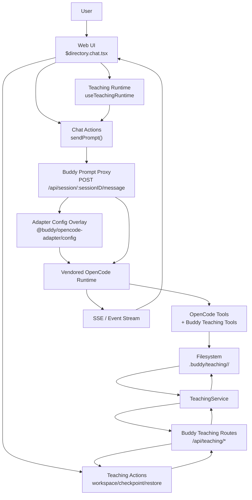

# CodeBuddy Implementation Overview

> Historical note: this document predates the Buddy core ontology cutover. References here to `code-teacher`, `curriculum-builder`, notebook-local curriculum ownership, and older prompt file paths describe the previous architecture and are not the current source of truth. Use [buddy-core.spec.md](/Users/prashantbhudwal/Code/buddy/buddy-core.spec.md) for the current model.

This document describes the current teaching-mode implementation that was added to Buddy.

It is not a speculative plan. It is a description of the code that exists in the repository now, how it is wired, what responsibilities live in which files, how data moves through the system, how permissions work, where prompts come from, and what the known limitations still are.

The feature introduced here is an in-app code-teaching workflow built on top of the existing Buddy chat experience.

The core product idea is:

- keep the existing project/session chat model,
- add a new primary agent called `code-teacher`,
- render an editor inside the existing chat route,
- back that editor with one or more real files on disk,
- let the agent guide the learner using the same core OpenCode runtime and tool system,
- add a small Buddy-owned teaching layer for workspace lifecycle, prompt shaping, and teaching-specific tools.

## 1. High-Level Product Shape

The implementation does not create a separate teaching application surface.

Instead:

- the user stays inside the normal directory chat route,
- the prompt composer gets a real persona selector plus strategy controls,
- the session stays in normal chat mode until the user explicitly starts an interactive lesson,
- the selected teaching runtime remains independent from the session interaction mode,
- the route keeps the normal chat layout,
- the editor is exposed as a docked panel inside the existing right sidebar,
- the editor tab can render an empty interactive starter state before any workspace exists,
- the right editor is backed by a tracked teaching workspace under `.buddy/teaching/<sessionID>/`,
- the active file can be switched, and new tracked files can be added from the editor panel,
- the backend injects additional teaching context into each prompt sent for that session.

This means teaching mode is "just another session" inside the same project/session mental model, with an editor-capable right panel instead of a separate page layout.

## 2. Architectural Guardrail

Buddy still uses vendored OpenCode as the core runtime.

That remains the main architectural rule:

- core loop, session execution, SSE updates, tool runtime, permission enforcement, and agent execution still come from vendored OpenCode modules,
- Buddy adds a compatibility/product layer around them,
- the teaching feature lives in Buddy-owned files and is injected into the existing OpenCode flow instead of replacing it.

In practical terms:

- the backend still proxies into the vendored OpenCode app,
- the frontend still uses the same chat sync/store flow,
- Buddy adds:
  - a new agent entry,
  - new prompt shaping,
  - new teaching routes,
  - new teaching tools,
  - new frontend state and UI for the lesson editor.

## 3. Files Added or Changed

### Backend

- `packages/opencode-adapter/src/config.ts`
- `packages/opencode-adapter/package.json`
- `packages/buddy/src/index.ts`
- `packages/buddy/src/session/prompts/code-teacher.txt`
- `packages/buddy/src/agent/prompts/curriculum-builder.txt`
- `packages/buddy/src/teaching/types.ts`
- `packages/buddy/src/teaching/teaching-path.ts`
- `packages/buddy/src/teaching/teaching-service.ts`
- `packages/buddy/src/teaching/teaching-tools.ts`
- `packages/buddy/src/routes/teaching.ts`

### Frontend

- `packages/web/src/routes/$directory.chat.tsx`
- `packages/web/src/components/prompt/prompt-composer.tsx`
- `packages/web/src/components/teaching/teaching-editor-panel.tsx`
- `packages/web/src/state/chat-actions.ts`
- `packages/web/src/state/teaching-runtime.ts`
- `packages/web/src/state/teaching-actions.ts`
- `packages/web/src/state/ui-preferences.ts`
- `packages/web/package.json`

## 4. Backend Overview

## 4.0 High-Level Data Flow Diagram (DFD)

This is the current runtime data-flow shape:

- the web route owns editor/session UI state,
- Buddy teaching routes own workspace lifecycle and persistence,
- the filesystem is the canonical lesson state,
- Buddy's prompt proxy injects teaching context,
- an adapter-level config overlay makes `code-teacher` a real OpenCode agent at runtime,
- vendored OpenCode still executes the actual session/tool loop.

Reading the diagram left to right / top to bottom:

- the user interacts with one existing chat route,
- editor operations go through Buddy-owned teaching APIs into disk-backed workspace state,
- prompt sends go through Buddy's compatibility proxy into the vendored OpenCode runtime,
- the runtime uses both standard OpenCode tools and Buddy teaching tools,
- results stream back over the normal SSE path to the same chat UI.

## 4.1 `packages/buddy/src/index.ts`

This file remains the main Buddy HTTP composition layer and the most important integration point for teaching mode.

The teaching-related responsibilities in this file are:

- mounting the teaching route group under `/api/teaching`,
- ensuring Buddy teaching tools are registered into the OpenCode runtime before prompt execution,
- returning Buddy's persona catalog from `/api/config/personas`,
- transforming prompt requests before proxying them to OpenCode,
- injecting runtime teaching state and learner context.

### Key teaching behaviors in `index.ts`

#### A. Tool registration before prompt execution

When Buddy proxies a request into OpenCode through `fetchOpenCode(...)`, it conditionally registers Buddy tools first.

If `registerTools` is `true`, Buddy registers:

- curriculum tools
- teaching tools

This ensures the OpenCode runtime sees Buddy-owned tools without rewriting the core runtime.

#### A2. Runtime config overlay

Buddy now installs an adapter-level in-memory config overlay before prompt execution.

That overlay adds a real `cfg.agent["code-teacher"]` entry to the vendored OpenCode runtime without writing any project config files.

This is implemented through:

- `packages/opencode-adapter/src/config.ts`
- the `setConfigOverlay(...)` call in `packages/buddy/src/index.ts`

The overlay is merged into `Config.get()` at runtime and is scoped by `Instance.directory`.

This is what makes `code-teacher` a native upstream-recognized agent now.

#### B. Buddy-owned persona list

`GET /api/config/personas` returns the Buddy persona catalog used by the product UI.

This matters because:

- the product UI now selects `persona`, not raw agents,
- persona selection controls the available surfaces and defaults,
- raw agent overrides remain a backend/debug escape hatch rather than a primary UI concept.

#### C. Prompt proxy transform

`POST /api/session/:sessionID/message` is the key prompt compatibility endpoint.

Before the prompt is proxied upstream, Buddy transforms the request body:

- `content` is converted into a `parts` array if needed,
- the Buddy-only `teaching` payload is parsed and consumed,
- Buddy system prompt content is generated and merged into `system`,
- the Buddy-only `teaching` field is removed before forwarding.

This is the most important point in the feature because it is where Buddy adds teaching semantics without replacing OpenCode's prompt execution path.

#### D. `code-teacher` is now a native upstream-recognized runtime agent

OpenCode now sees `code-teacher` as a real agent through the adapter config overlay.

The current flow is:

- Buddy builds an in-memory config overlay,
- the overlay adds `agent.code-teacher` into the runtime config seen by vendored OpenCode,
- OpenCode resolves `Agent.get("code-teacher")` normally,
- prompt, steps, and permission behavior come from the upstream agent-resolution path.

This removes the previous `code-teacher -> build` alias and makes the runtime agent identity coherent.

### Teaching prompt assembly in `index.ts`

Buddy builds extra prompt content with `buildBuddySystemPrompt(...)`.

For teaching turns it can inject:

- condensed curriculum context,
- `<teaching_workspace>` context,
- `<teaching_policy>` behavior rules.

The dedicated `code-teacher` prompt itself now comes from the real upstream-resolved agent config entry created by the adapter overlay. Buddy injects only the dynamic teaching context and policy blocks on top of that.

## 4.2 `packages/buddy/src/index.ts` (OpenCode agent overlay)

Buddy no longer keeps a separate local agent catalog.

Instead, `index.ts` builds an in-memory OpenCode config overlay and injects Buddy-specific agents into the vendored runtime before listing agents or executing prompts.

The important effect is:

- OpenCode remains the source of truth for vendor-native agents like `build`, `plan`, `general`, and `explore`.
- Buddy adds `code-teacher` and `curriculum-builder` as overlay-defined agents.
- Buddy can still override vendor-native agents by name through Buddy config, but the final resolved catalog comes from the vendored OpenCode runtime.

This keeps the UI-visible agent list and the actual execution-time agent behavior aligned.

## 4.3 `packages/buddy/src/session/prompts/code-teacher.txt`

This file contains the dedicated teacher behavior prompt.

It instructs the model to:

- treat the lesson file as the shared whiteboard,
- read the lesson file before giving corrective feedback,
- use `teaching_set_lesson` for whole-scaffold changes,
- avoid raw full-file `write` when `teaching_set_lesson` is the correct tool,
- avoid advancing on weak completion claims like `done`,
- verify before acceptance,
- use `teaching_checkpoint` only after verified acceptance,
- use `teaching_restore_checkpoint` to recover the current exercise when needed,
- keep the lesson file and the explanation synchronized.

This file defines the intended teacher behavior.

The same prompt text is also used when Buddy constructs the adapter-level OpenCode config overlay, so the vendored runtime receives `code-teacher` as a true agent with this prompt.

Buddy no longer needs to fake this by aliasing the agent to `build`.

## 4.4 `packages/buddy/src/teaching/types.ts`

This file defines the core backend teaching types and schemas.

Main schemas:

- `TeachingLanguageSchema`
  - currently `"ts"` or `"tsx"`
- `TeachingWorkspaceRecordSchema`
  - persisted metadata for the teaching workspace
- `TeachingWorkspaceResponseSchema`
  - API response shape for the current workspace
- `TeachingWorkspaceUpdateRequestSchema`
  - save payload for editor writes
- `TeachingPromptContextSchema`
  - Buddy-only prompt context sent from the frontend

### Important note

Although the current language enum is still TS-oriented (`ts` / `tsx`), the teaching workflow itself is structured generically:

- a workspace,
- a set of tracked files,
- a mirrored checkpoint snapshot for each tracked file,
- an active editor file,
- a revision,
- selection metadata.

The current file naming is TS-first, but the architecture is a general teaching workspace pattern.

## 4.5 `packages/buddy/src/teaching/teaching-path.ts`

This file defines the on-disk workspace layout.

For a given `(directory, sessionID)`:

- root: `.buddy/teaching/<safeSessionID>/`
- metadata: `.buddy/teaching/<safeSessionID>/workspace.json`
- active and secondary files: `.buddy/teaching/<safeSessionID>/files/<relativePath>`
- checkpoint snapshots: `.buddy/teaching/<safeSessionID>/checkpoints/<relativePath>`

The session ID is sanitized with `safeSessionID(...)` so only:

- alphanumeric,
- `.`,
- `_`,
- `-`

remain in the folder name.

## 4.6 `packages/buddy/src/teaching/teaching-service.ts`

This is the canonical backend service for all teaching workspace filesystem operations.

No teaching file writes should bypass this module.

### Internal concepts

The service stores:

- a set of tracked files under `files/`,
- a checkpoint snapshot for each tracked file under `checkpoints/`,
- one active tracked file that is mirrored into the top-level response fields for compatibility,
- a metadata record (`workspace.json`) containing:
  - `sessionID`
  - active-file compatibility fields (`language`, `lessonFilePath`, `checkpointFilePath`, `fileHash`)
  - `files`
  - `activeRelativePath`
  - `revision`
  - `timeCreated`
  - `timeUpdated`

### Key design choice: disk is the source of truth

The frontend editor is not the canonical source of truth.

The tracked teaching files on disk are the canonical state.

The service keeps the metadata record in sync with those files using:

- per-file hashes
- `revision`

### Major functions

#### `ensure(directory, sessionID, language)`

Creates the teaching workspace if it does not exist.

It creates:

- workspace folder
- `files/`
- `checkpoints/`
- an initial tracked file (`lesson.ts` or `lesson.tsx`)
- a matching checkpoint snapshot
- metadata record

Initial lesson code is currently an empty string.

#### `read(directory, sessionID)`

Reads the workspace and returns a normalized response.

Before returning, it calls `syncRecord(...)` to detect whether any tracked file changed on disk outside the metadata flow. If any tracked file hash changed, the service increments the revision and updates metadata.

This is how agent-side file writes can be observed and surfaced back to the frontend.

Each normalized workspace response now also attempts to load server-backed LSP diagnostics for the active teaching file and includes:

- `lspAvailable`
- `diagnostics`

Those diagnostics come from the vendored OpenCode LSP runtime, not from Buddy re-implementing language analysis.

#### `save(directory, sessionID, input)`

This is the main editor-save path.

It:

- syncs the current metadata first,
- compares `expectedRevision` against the latest revision,
- throws a conflict if the file changed since the editor's last known revision,
- writes the active tracked file,
- optionally changes file extension if language changed,
- preserves that file's checkpoint content across language switch,
- increments revision and updates metadata.

This implements optimistic concurrency for the editor.

#### `checkpoint(directory, sessionID)`

Copies every tracked file into its checkpoint snapshot.

This is the "accept current step" operation.

It also returns whether the lesson changed since the last accepted checkpoint:

- `changedSinceLastCheckpoint`

#### `status(directory, sessionID)`

Returns lightweight current status:

- revision
- active lesson path
- active checkpoint path
- tracked file list
- whether any tracked file differs from its checkpoint

This is used when building prompt context so the teacher knows whether the current exercise is already accepted or still pending acceptance.

#### `setLesson(directory, sessionID, { content, language? })`

This is the canonical "replace the whole lesson scaffold" operation.

It:

- writes the new content into the active tracked file,
- writes the same content into that file's checkpoint snapshot,
- increments revision,
- updates metadata,
- optionally switches the active file extension.

The key semantic difference from `save(...)` is:

- `save(...)` is the editor's optimistic save path,
- `setLesson(...)` is a canonical reset/switch path that intentionally makes the new scaffold the accepted baseline.

This was added to keep the editor and the accepted checkpoint synchronized when the teacher introduces a new exercise.

#### `restore(directory, sessionID)`

Restores the tracked workspace from the last accepted checkpoint snapshots.

It:

- reads each checkpoint snapshot,
- writes it back into the corresponding tracked file,
- increments revision when anything changed,
- updates metadata.

This was added to recover from teacher drift or destructive lesson rewrites.

### Error types

- `TeachingWorkspaceNotFoundError`
- `TeachingRevisionConflictError`

The conflict error carries:

- `revision`
- `code`
- active `lessonFilePath`

so the frontend can surface a conflict UI.

#### `addFile(directory, sessionID, input)`

Creates a new tracked file in the teaching workspace and optionally makes it the active editor file.

#### `activateFile(directory, sessionID, relativePath)`

Switches which tracked file is currently active in the editor without changing the main revision.

## 4.7 `packages/buddy/src/teaching/teaching-tools.ts`

This file defines Buddy-owned OpenCode tools for teaching mode.

These tools are registered into the OpenCode runtime per directory.

### Registered tools

#### `teaching_checkpoint`

Purpose:

- copy all tracked files to their checkpoint snapshots

Behavior:

- loads current teaching workspace,
- asks for permission with:
  - permission name: `teaching_checkpoint`
- calls `TeachingService.checkpoint(...)`
- returns checkpoint metadata

#### `teaching_set_lesson`

Purpose:

- replace the current lesson scaffold and synchronize the checkpoint with it

Behavior:

- takes full lesson `content`
- optional `language`
- asks for permission with:
  - permission name: `teaching_set_lesson`
- calls `TeachingService.setLesson(...)`
- returns the new workspace metadata

This is the preferred whole-lesson transition tool.

#### `teaching_add_file`

Purpose:

- create an additional tracked file so a lesson can span multiple files

Behavior:

- takes a workspace-relative file path
- optional starter content
- optional language/activation
- asks for permission with:
  - permission name: `teaching_add_file`
- calls `TeachingService.addFile(...)`
- returns the updated workspace metadata

#### `teaching_restore_checkpoint`

Purpose:

- restore the lesson file from the last accepted checkpoint

Behavior:

- asks for permission with:
  - permission name: `teaching_restore_checkpoint`
- calls `TeachingService.restore(...)`
- returns the restored workspace metadata

### Why these tools exist

They create structured teaching operations that raw `write` does not provide.

Without them, the model can replace the lesson file in ways that desynchronize:

- what the assistant says,
- what the learner sees,
- what the app thinks is the accepted step.

These tools reduce that drift by making file creation, whole lesson replacement, and restore accepted state explicit, higher-level actions.

## 4.8 `packages/buddy/src/routes/teaching.ts`

This file defines Buddy's HTTP API surface for the teaching workspace.

All routes require the same directory validation pattern used elsewhere in Buddy.

### Routes

#### `POST /api/teaching/session/:sessionID/workspace`

Idempotently provisions or returns the session's teaching workspace.

Optional body:

- `language`

Returns:

- session ID
- workspace root
- language
- lesson file path
- checkpoint file path
- tracked file list
- active relative path
- revision
- current code

#### `GET /api/teaching/session/:sessionID/workspace`

Returns the latest workspace snapshot.

#### `PUT /api/teaching/session/:sessionID/workspace`

Saves editor changes.

Body:

- `code`
- `expectedRevision`
- optional `relativePath`
- optional `language`

Conflict behavior:

- returns `409` with latest revision and code if the file changed on disk first

#### `POST /api/teaching/session/:sessionID/file`

Creates a new tracked teaching file and returns the updated workspace snapshot.

#### `POST /api/teaching/session/:sessionID/active-file`

Switches the active editor file and returns the updated workspace snapshot.

#### `POST /api/teaching/session/:sessionID/checkpoint`

Marks the current lesson state as accepted by copying lesson to checkpoint.

This is what the UI currently labels as `Accept Step`.

#### `POST /api/teaching/session/:sessionID/restore`

Restores the lesson file from the last accepted checkpoint.

This is what the UI currently labels as `Restore Step`.

## 5. Frontend Overview

## 5.1 `packages/web/src/state/teaching-runtime.ts`

This file holds session-scoped teaching state in a persisted Zustand store.

### Store shape

#### `selectedPersonaBySession`

Maps:

- `"<directory>::<sessionID>" -> personaId`

This stores the selected Buddy persona per chat session.

#### `selectedStrategyBySession`

Maps:

- `"<directory>::<sessionID>" -> instructionalStrategy`

This stores the selected teaching strategy per chat session.

#### `selectedAdaptivityBySession`

Maps:

- `"<directory>::<sessionID>" -> adaptivity`

This stores whether the session is running in manual or auto strategy selection.

#### `workspaceBySession`

Maps:

- `"<directory>::<sessionID>" -> TeachingWorkspaceState`

This holds the live editor/workspace state for the session.

### `TeachingWorkspaceState`

Extends the backend workspace response with UI-only state:

- `savedCode`
- `pendingSave`
- `saveError`
- `conflict`
- `selection`

The embedded workspace data now also includes:

- `files`
- `activeRelativePath`

### Important behavior

#### A. Teaching runtime selections are persisted

The store persists:

- `selectedPersonaBySession`
- `selectedStrategyBySession`
- `selectedAdaptivityBySession`

It does not persist:

- `workspaceBySession`

That means the editor state is always reloaded from the backend on page load, which matches the "disk is source of truth" rule.

#### B. Remote sync behavior

`applyRemoteSnapshot(...)` is the key external-file-change handler.

Current logic:

- if there is no local workspace, adopt remote snapshot
- if local editor content matches the remote code, adopt remote snapshot
- if there are no local unsaved edits, adopt remote snapshot automatically
- if there are unsaved local edits and remote code differs, create a conflict state instead of overwriting

This is the fix that stopped agent-written lesson changes from being treated as spurious conflicts when the learner had not typed anything locally.

## 5.2 `packages/web/src/state/teaching-actions.ts`

This file is the frontend client for the teaching API.

Functions:

- `ensureTeachingWorkspace(...)`
- `loadTeachingWorkspace(...)`
- `saveTeachingWorkspace(...)`
- `createTeachingWorkspaceFile(...)`
- `activateTeachingWorkspaceFile(...)`
- `checkpointTeachingWorkspace(...)`
- `restoreTeachingWorkspace(...)`

### Notable behavior

`saveTeachingWorkspace(...)` treats `409` specially:

- it parses the conflict payload,
- throws `TeachingConflictError`,
- the route code uses that to populate conflict UI state.

## 5.3 `packages/web/src/state/chat-actions.ts`

The important teaching change here is in `sendPrompt(...)`.

It now accepts an optional third argument:

- `agent`
- `teaching`

So the frontend can send:

- the session-scoped selected agent
- the Buddy-only `TeachingPromptContext`

The request still goes to the same compatibility endpoint:

- `POST /api/session/:sessionID/message`

Buddy consumes the `teaching` field on the backend and strips it before forwarding upstream.

## 5.4 `packages/web/src/components/prompt/prompt-composer.tsx`

This component now has a real working persona selector plus strategy and Auto controls.

The first dropdown is no longer a placeholder.

It renders the supplied persona options and calls:

- `onPersonaChange(...)`
- `onStrategyChange(...)`
- `onAutoChange(...)`

That is how the user selects:

- `build`
- `plan`
- `code-teacher`

from the active chat session.

## 5.5 `packages/web/src/components/teaching/teaching-editor-panel.tsx`

This is the right-hand lesson editor panel.

It uses:

- `@monaco-editor/react`
- `monaco-editor`

### UI elements

- language selector (`ts` / `tsx`)
- lesson file path label
- tracked file tree
- `New File` button
- revision indicator
- save status indicator
- `Accept Step` button
- `Restore Step` button
- conflict banner
- save error banner
- LSP diagnostics panel
- Monaco editor

### Current editor behavior

- the editor is controlled via `value={workspace.code}`
- the editor path is the lesson file path
- the active file can be switched from the file tree
- nested folders are grouped visually from relative paths
- the user can create a new tracked file directly from the panel
- the editor theme is `vs-dark`
- Monaco layout is nudged on mount and when code changes
- server-backed diagnostics are rendered both as Monaco markers and in the diagnostics panel
- cursor selection is tracked and reported back to state

### Important fix

The panel now preserves its base layout classes even when a `className` prop is passed.

That fixed the earlier issue where the route-provided class replaced the base flex layout, causing Monaco to collapse to a tiny height.

## 5.6 `packages/web/src/routes/$directory.chat.tsx`

This is the main frontend orchestration layer for the feature.

It keeps the existing route and adds teaching mode as a branch inside it.

### Main teaching responsibilities in this route

#### A. Teaching runtime catalog loading

On directory change, it loads:

- `/api/config/personas`
- `/api/config`

Then it:

- computes the default persona
- reads the default strategy and adaptivity
- populates the composer's persona and strategy controls

#### B. Session-scoped teaching runtime selection

The route computes:

- `sessionKey = <directory>::<sessionID>`
- `selectedAgent = store value or defaultAgent`
- `interactionMode = chat | interactive`

Agent choice and interaction mode are intentionally separate.

#### C. Teaching mode activation

Interactive mode is active when:

- there is a session ID
- `interactionModeBySession[sessionKey] === "interactive"`

Before that, the `Editor` tab still exists and shows an empty starter state with:

- language picker
- current selected agent
- `Start Interactive Lesson` action

When the user starts the interactive lesson:

- the route upgrades the current session to interactive mode
- the route ensures the teaching workspace exists lazily
- the right sidebar is switched to the `Editor` tab and opened once on first entry for that session

The workspace is provisioned by:

- `POST /api/teaching/session/:sessionID/workspace`

#### D. Busy-to-idle refresh

When the assistant stops running (`busy -> idle`), the route reloads the teaching workspace.

This is how agent-side file changes are pulled back into the editor after the model writes to disk.

#### E. Autosave

When the editor code changes:

- if there is no conflict
- and `code !== savedCode`

the route debounces for `500ms` and then calls `flushTeachingWorkspace()`.

`flushTeachingWorkspace()`:

- checks for existing in-flight saves
- checks conflict state
- computes whether there are changes
- sends `PUT /api/teaching/session/:sessionID/workspace`
- includes the active relative path
- applies save success or conflict

#### F. Conflict handling

If the backend returns a revision conflict:

- the route stores a conflict payload in `TeachingRuntimeState`
- the editor shows conflict UI
- the user can:
  - load external changes
  - force overwrite

#### G. Flush-before-send

Before sending a prompt in interactive mode:

- the route flushes pending editor changes first
- if the flush fails or there is an unresolved conflict, the prompt is blocked

This ensures the agent sees the latest lesson file on disk when it runs.

#### H. Prompt context shaping

If interactive mode is active, the route constructs a `teaching` payload containing:

- `active`
- `sessionID`
- `lessonFilePath`
- `checkpointFilePath`
- `language`
- `revision`
- current selection

That payload goes through `sendPrompt(...)` to the Buddy backend.

#### I. Shared chat shell + right sidebar editor

The main chat layout stays the same whether teaching is active or not.

When teaching is active:

- the header shows an `Editor` toggle
- clicking `Editor` opens or closes the existing right sidebar on the `Editor` tab
- the right sidebar can switch between:
  - `Curriculum`
  - `Editor`
- the main transcript and prompt composer stay in their normal full-width chat shell
- the editor panel can switch between tracked files and create new ones without leaving the chat shell

This preserves one route and one sidebar architecture instead of introducing a separate teaching layout mode.

#### J. Accept and restore actions

The route wires:

- `Accept Step` -> `POST /api/teaching/session/:sessionID/checkpoint`
- `Restore Step` -> `POST /api/teaching/session/:sessionID/restore`

`Restore Step` then replaces the local editor state with the restored workspace snapshot.

## 5.7 `packages/web/src/state/ui-preferences.ts`

This file was also changed to restore/retain:

- `rightSidebarTab`

That state now also drives the teaching editor shell:

- `curriculum` keeps the normal notes panel open
- `editor` shows the teaching editor in the same right sidebar

This is what lets the editor behave like a normal right-side panel instead of a separate page mode.

## 5.8 `packages/web/package.json`

Teaching mode adds Monaco dependencies:

- `@monaco-editor/react`
- `monaco-editor`

This is the main bundle-level cost introduced by the feature.

## 6. End-to-End Data Flow

This section describes how data moves through the system in the current implementation.

## 6.1 Entering Interactive Mode

1. User opens a normal directory chat session.
2. Frontend loads personas from `/api/config/personas` and runtime defaults from `/api/config`.
3. User selects a persona and optional strategy in the prompt composer.
4. Frontend stores that teaching runtime choice in `TeachingRuntimeState`.
5. User opens the `Editor` tab and sees the empty interactive starter state.
6. User picks the initial language and clicks `Start Interactive Lesson`.
7. Frontend stores `interactionMode = "interactive"` for the session.
8. The route ensures the teaching workspace exists.
9. On first interactive entry for that session, the route opens the existing right sidebar on the `Editor` tab.
10. Backend provisions `.buddy/teaching/<sessionID>/...` if missing.
11. Frontend stores the returned workspace in `workspaceBySession`.
12. The main chat layout remains unchanged; the editor lives in the right sidebar.

## 6.2 Editing in the Right Sidebar Editor

1. User types in Monaco while one tracked file is active.
2. `TeachingEditorPanel` calls `onCodeChange(...)`.
3. Route updates `TeachingRuntimeState.workspaceBySession[sessionKey].code`.
4. A `500ms` debounce waits.
5. `flushTeachingWorkspace()` runs.
6. Frontend sends:
   - current `code`
   - current `expectedRevision`
   - optional `language`
7. Backend validates revision and writes the active tracked file.
8. Backend increments revision and returns the updated workspace.
9. Frontend applies save success:
   - updates `savedCode`
   - clears pending save
   - clears conflict

## 6.3 Sending a Prompt in Interactive Mode

1. User submits the prompt from the left chat composer.
2. Route checks whether interactive mode is active.
3. If yes, it flushes editor changes first.
4. If unresolved conflict exists, send is blocked.
5. The route builds `TeachingPromptContext`.
6. `sendPrompt(...)` sends:
   - `content`
   - `agent: <selected agent>`
   - `teaching: { ... }`
7. Backend receives the prompt.
8. Buddy:
   - parses the `teaching` payload,
   - builds Buddy system prompt content,
   - injects curriculum + session mode + teaching context,
   - injects teaching policy when the selected agent is `code-teacher`,
   - ensures the OpenCode runtime has the `code-teacher` agent definition via the adapter config overlay,
   - strips the `teaching` field,
   - proxies to OpenCode.
9. OpenCode resolves the selected agent natively and runs the session using its normal runtime.

## 6.4 Agent Writes the Lesson File

If the model edits a tracked teaching file using file tools:

1. The tool writes a tracked file on disk.
2. Buddy frontend does not instantly subscribe to raw filesystem events.
3. After the session transitions from `busy` to `idle`, the route reloads the workspace.
4. Backend `read(...)` calls `syncRecord(...)`.
5. If file hash changed:
   - backend bumps revision,
   - backend returns updated code.
6. Frontend `applyRemoteSnapshot(...)` decides:
   - auto-apply remote change if there are no local unsaved edits
   - otherwise create a conflict

This is how the editor stays in sync with agent writes.

## 6.5 Accepting a Step

1. User clicks `Accept Step`, or the agent can call `teaching_checkpoint`.
2. Backend copies all tracked files to checkpoint snapshots.
3. Checkpoint now becomes the accepted baseline.
4. Future prompt context can say whether the lesson differs from that checkpoint.

This is the only explicit "accepted" marker in the current system.

## 6.6 Restoring a Step

1. User clicks `Restore Step`, or the agent can call `teaching_restore_checkpoint`.
2. Backend reads the checkpoint snapshots.
3. Backend overwrites each tracked file with its checkpoint content.
4. Backend bumps revision and returns the updated workspace.
5. Frontend replaces the editor content with that restored snapshot.

This is the recovery path for lesson drift.

## 7. Prompt Layering

There are three important prompt sources in the current teaching flow.

## 7.1 Global learning behavior

Buddy's existing general learning behavior comes from the regular behavior prompt loaded by:

- `loadBehavior()`

This is still used for normal agents, but it is intentionally skipped for `code-teacher`.

## 7.2 Dedicated code-teacher behavior

The `code-teacher` prompt text lives in:

- `packages/buddy/src/session/prompts/code-teacher.txt`

Buddy uses this prompt text in two places:

- the Buddy product-layer agent catalog
- the adapter-level OpenCode config overlay

That means the vendored runtime now resolves `code-teacher` as a real agent whose prompt is this file.

## 7.3 Dynamic teaching system blocks

Buddy generates two dynamic blocks:

### `<teaching_workspace>`

Contains:

- session ID
- lesson file path
- checkpoint file path
- language
- revision
- tracked file list
- optional current selection
- checkpoint status (`accepted` or `pending acceptance`)

This grounds the model in the live editor/workspace state.

### `<teaching_policy>`

Contains:

- the rule that the learner stays on the current exercise until verified
- instruction not to treat `done` as proof
- instruction to verify before advancing
- instruction to use `teaching_set_lesson` for full lesson replacement
- instruction not to raw-write the whole lesson when the structured tool is appropriate
- an extra line when the latest user message is recognized as a completion claim

This is the current main mitigation against premature lesson advancement.

## 7.4 Curriculum injection

If a curriculum exists for the project, Buddy still injects a condensed `<curriculum>` block for teaching turns.

So the teacher receives:

- dedicated teacher prompt
- curriculum context
- teaching workspace state
- teaching policy

## 8. Permission Model

There are multiple layers of permissions in the current implementation.

## 8.1 Directory-level request boundary

All Buddy endpoints resolve a directory from:

- query param
- `x-buddy-directory`
- `x-opencode-directory`
- fallback `process.cwd()`

Then Buddy validates it against allowed directory roots.

If the directory is outside allowed roots, the request is rejected.

This is the main outer sandbox boundary for Buddy's compatibility layer.

## 8.2 Agent permission rules

Buddy's local agent catalog defines permission rules for `code-teacher`, including:

- allowing teaching tools
- denying todo/task tools

This shapes the intended capabilities of the teacher.

## 8.3 OpenCode runtime permissions

Actual tool execution still happens through the vendored OpenCode runtime.

That means:

- tool permission prompts,
- path-based file permissions,
- `edit` confirmations,
- `bash` behavior,
- `external_directory` checks

still use the existing OpenCode permission machinery.

Buddy does not replace that runtime.

## 8.4 Teaching tool permissions

Buddy's teaching tools ask for explicit permission names:

- `teaching_checkpoint`
- `teaching_add_file`
- `teaching_set_lesson`
- `teaching_restore_checkpoint`

These show up as normal permission-mediated actions in the runtime.

## 8.5 Raw shell and file tools remain broad

The current implementation does not sandbox the teacher to only the tracked teaching files.

The teacher still operates in the same broad project context as the existing coding agent model.

That means:

- the agent can still read or edit other project files,
- the agent can still use shell within the repo scope,
- the feature accepts a broad blast radius for dogfooding.

The structured teaching tools reduce drift for lesson transitions, but they do not fully sandbox the teacher.

## 8.6 Frontend permission UI

The chat route still renders the existing `PermissionDock` in the left column when there are pending permission requests.

Teaching mode did not create a separate permission UI.

The same chat-area permission dock is still the approval surface.

## 9. Current Synchronization Model

The current system keeps chat and editor synchronized using a mix of:

- disk-backed source of truth,
- revision tracking,
- post-run reload,
- conflict detection,
- explicit checkpointing,
- explicit restoration.

What keeps them aligned:

- the tracked teaching files are real and live on disk,
- prompt send flushes local edits first,
- busy-to-idle reload re-pulls agent-written changes,
- remote changes auto-apply when the user has no unsaved edits,
- accepted state is represented by checkpoint snapshots,
- whole lesson replacement now has a dedicated tool (`teaching_set_lesson`),
- additional files can be created through `teaching_add_file` or the editor UI,
- restoration has a dedicated tool and API path.

What can still drift:

- if the model ignores the intended tool and uses raw full-file `write` anyway,
- if the learner restores to a checkpoint that was never properly accepted,
- if the teacher makes a poor pedagogical decision without a deterministic checker.

## 10. Known Limitations

The current implementation is materially better than the first teaching pass, but several limitations still remain.

## 10.1 No deterministic exercise checker yet

This is the biggest remaining gap.

Right now:

- the agent still decides whether the learner's work is correct,
- Buddy mitigates that with stronger prompt policy,
- but there is no formal `Check` button or structured pass/fail validator yet.

So correctness is still largely model-judged.

This means:

- the agent can still misjudge,
- the system is safer than before,
- but not yet reliable in the way a real exercise platform should be.

## 10.2 The language model is still TS-oriented at the workspace file level

The teaching architecture is generic, but the current concrete language enum and file extensions are:

- `.ts`
- `.tsx`

That is a product-layer limitation, not a fundamental architecture limit.

## 10.3 Runtime identity is now coherent, but the config overlay is Buddy-specific

`code-teacher` now resolves as a real upstream runtime agent through the adapter-level config overlay.

That is a much better design than the earlier alias-to-`build` approach.

The remaining limitation is that this agent definition is still injected by Buddy at runtime rather than being authored by the user in a project config file.

That is intentional because it avoids repo config pollution, but it means Buddy is still the layer responsible for providing the teaching agent definition to the vendored runtime.

## 10.4 Raw shell is still broad

The teacher is not restricted to `.buddy/teaching/*`.

This was an intentional dogfood tradeoff.

It makes the teacher more powerful, but also increases risk.

## 10.5 Monaco is bundled directly into the chat route

This works, but it increases bundle weight.

The editor is not yet lazy-loaded behind a separate chunk boundary.

## 10.6 Multi-file support is still minimal

The workspace can now track multiple files, and the UI now renders them in a lightweight file tree inside the editor sidebar.

There is still no drag-and-drop file management, file rename/delete flow, or richer per-file metadata yet.

## 11. What Was Fixed Along the Way

Several implementation issues were found and corrected while building this feature.

### 11.1 Persona selector now drives Buddy teaching runtime

Earlier cause:

- the product UI was still too close to raw agent concepts.

Fix:

- Buddy now uses `/api/config/personas` and stores persona, strategy, and adaptivity in teaching runtime state.

### 11.2 Agent-written lesson changes did not auto-appear

Cause:

- remote file changes were treated as conflicts even when the user had no unsaved local edits.

Fix:

- `applyRemoteSnapshot(...)` now auto-applies remote changes when there are no local unsaved edits.

### 11.3 Editor collapsed to tiny height

Cause:

- route-supplied `className` replaced the editor panel's base flex layout classes.

Fix:

- `TeachingEditorPanel` now appends external classes instead of replacing its base layout.

### 11.4 Right sidebar overlapped the editor

Cause:

- the right sidebar surfaces used translucent backgrounds, so the Monaco editor showed through the panel.

Fix:

- the sidebar surfaces now use opaque backgrounds and clip their contents correctly.

### 11.5 The teacher advanced lessons based on weak completion claims

Cause:

- the teacher prompt was too loose,
- internal todo tools created fake progress semantics,
- there was no explicit policy for "done".

Fix:

- stronger teaching policy injection,
- explicit completion-claim detection,
- todo/task tools denied for `code-teacher`,
- acceptance/checkpoint state injected into the prompt,
- structured full-lesson and restore tools added.

### 11.6 `code-teacher` was incorrectly aliased to `build`

Cause:

- the first implementation treated `code-teacher` as a Buddy-only product concept,
- the backend rewrote the agent name at proxy time instead of making the vendored runtime recognize it.

Fix:

- an adapter-level in-memory config overlay now injects a real `cfg.agent["code-teacher"]` entry into the vendored OpenCode runtime,
- the alias was removed,
- OpenCode now resolves `code-teacher` natively during prompt execution.

### 11.7 Teaching UI was over-coupled to a separate layout mode

Cause:

- the first teaching implementation changed the main chat area into a split-pane teaching layout,
- that made the editor feel like a separate mode instead of a normal part of the chat shell,
- it also interfered with the normal sidebar mental model.

Fix:

- the main chat layout now stays unchanged,
- the editor lives in the existing right sidebar,
- the right sidebar can switch between `Curriculum` and `Editor`,
- starting an interactive lesson opens the sidebar on `Editor` once, but after that the user controls it like any other right-side panel.

### 11.8 Teaching workspaces were no longer limited to one file

Cause:

- the first implementation modeled a teaching session as one lesson file plus one checkpoint file,
- that made multi-file exercises awkward and pushed the agent toward raw repo edits outside the teaching model.

Fix:

- the teaching workspace now tracks multiple files,
- the right sidebar editor can switch the active file,
- the UI can create a new tracked file,
- the active file now surfaces server-backed LSP diagnostics in the editor,
- checkpoint and restore now operate across the tracked workspace instead of only one file.

## 12. Practical Mental Model for the Current Code

The easiest way to think about the system is:

- OpenCode still runs the conversation.
- Buddy wraps the prompt and tool surface.
- The editor is a view over a tracked teaching workspace.
- One tracked file is active at a time.
- The active file is the live working state shown in Monaco.
- The active file also carries server-backed LSP diagnostics when a matching language server is available.
- Checkpoint snapshots represent the accepted workspace state.
- The frontend keeps the editor synced to disk and blocks prompt sends until disk is current.
- The backend injects extra system context so the model knows:
  - what file is the editor,
  - whether the current step is accepted,
  - whether `done` should be treated as a verification request rather than permission to advance.

## 13. Recommended Next Step

The next major improvement should be a deterministic exercise checker.

That would add:

- a `Check` action,
- a generic validation contract,
- pass/fail as structured data,
- lesson advancement only after `passed: true`.

That would move correctness out of the model's subjective judgment and into an explicit acceptance pipeline.

Until that exists, the current implementation should be understood as:

- a much better structured teaching shell,
- with improved prompt policy and sync semantics,
- but still not a fully deterministic tutoring system.
